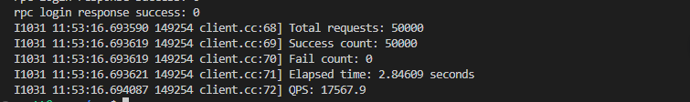

# rpc

# Lightweight Distributed RPC Framework

A lightweight C++11 RPC framework built from scratch with **Muduo**, **Protobuf**, and **ZooKeeper**, supporting distributed service registration, discovery, and asynchronous communication.  
Designed for learning and practical use — combining simplicity, modularity, and performance.

---

## 🚀 Features

- **Distributed Service Registry** — uses ZooKeeper to register and discover RPC services dynamically.
- **Protobuf-based Serialization** — compact binary protocol for cross-node communication.
- **Event-driven Networking** — built on Muduo for non-blocking, multi-threaded TCP I/O.
- **Custom RPC Protocol** — `(service_name, method_name, args_size)` format.
- **Client Abstractions** — encapsulated `RpcChannel` and `RpcController` for easy remote invocation.
- **High Performance** — achieves ~17.5k QPS with 500 threads × 100 requests and 100% success rate.

---

## 🧩 Architecture Overview

